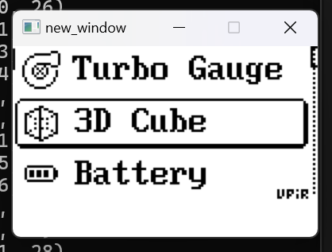

# How to use the example
## Wake Server First
```bash
cargo run
```
## Compile the example with libraries
```bash
gcc -g flipperzero_menu.c draw.c client.c -o client -lwsock32 -lWs2_32
```
```bash
gcc -g main.c draw.c client.c ./egg_ui_ex/aff_mat.c -o client -lwsock32 -lWs2_32
```
## Run
```bash
client.exe
```
## Example Result

### Tips 
press 'up' or 'down' in the cmd of the client to controll instead of entity button pressing
## Features
* **Efficient bitmap rendering engine written in Rust**.
* **Robust backend interface in C**, similar to U8g2 and other libraries, but with greater scalability.
* **Generic protocol** between client and server using sockets, which is easy to implement.
* Extremely **easy to port**. Please take a look at the [example](./rm_screen_simulator/screen_client/flipperzero_menu.c). The [original implementation](https://github.com/upiir/arduino_oled_menu?tab=readme-ov-file) was found randomly on GitHub (just search 'oled menu') to test the **portability** of this project. It seems quite efficient—took me only about **10 minutes to port and run successfully!**(You could see the process because I haven't deleted the original one but turned them into comments)


# TODO
* Add more interfaces to support real world using (Keep going...)
* High pixel performance testing and optimizations (50%)
* Linux version
* Generic UI framework (20%)
